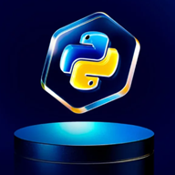
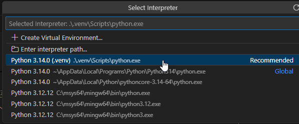
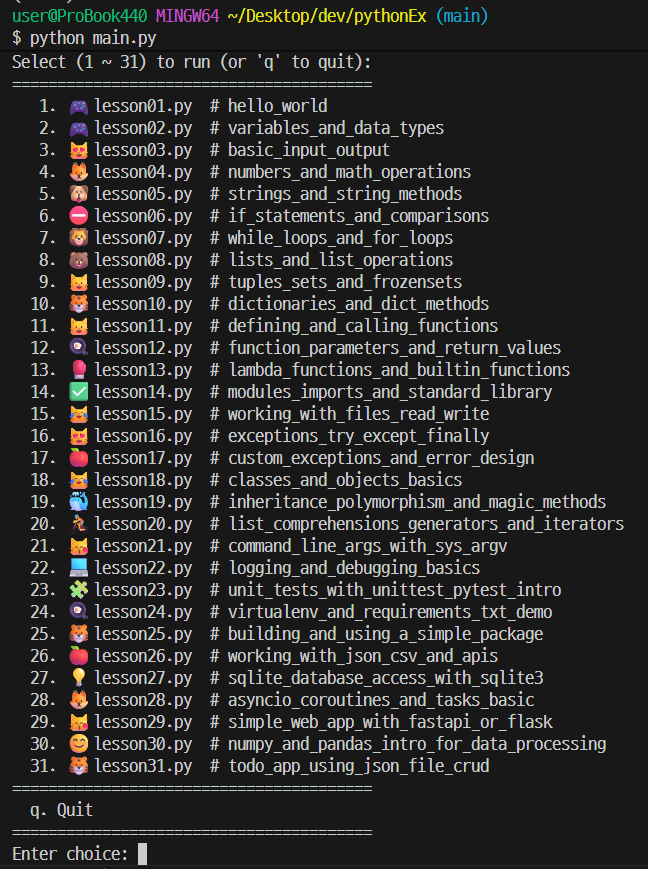
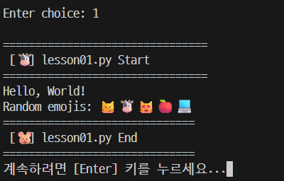

# Python 연습

[](https://github.com/GithubJoshuaPark/pythonEx.git)



아래 순서대로 Python을 연습을 위한 준비와 간단한 예제를 실행하는 방법을 안내합니다.

## 1. Python 설치

1-1. 파이썬 설치 파일 받기
브라우저(크롬 등)를 켭니다.
주소창에: https://www.python.org/downloads/ 입력 후 접속
화면 상단에 “Download Python 3.xx.x” (3으로 시작하는 최신 버전) 버튼이 보이면 클릭
예: Download Python 3.12.x
💡 가능하면 Microsoft Store버전 말고, python.org에서 받은 설치 파일을 쓰시는 걸 추천드립니다.

1-2. 설치 프로그램 실행
다운로드가 끝나면 아래처럼 진행합니다.
다운로드한 python-3.xx.x-amd64.exe 파일을 더블 클릭
설치 화면 맨 아래에 있는
✅ “Add python.exe to PATH” 를 꼭 체크합니다.

이거 체크해야 나중에 python 명령이 어디서나 잘 동작합니다.
그 다음에 “Install Now” 버튼 클릭
(처음이시라면 “Customize installation” 말고 “Install Now”로 가도 충분합니다.)
설치가 끝나면 “Setup was successful” 같은 문구가 뜰 겁니다.
창 닫기까지 해 주세요.

2단계. 설치가 잘 되었는지 확인
이제 정말로 파이썬이 깔렸는지 확인해 보겠습니다.

2-1. 명령 프롬프트 또는 PowerShell 열기
Win 키를 누르고
“cmd” 또는 “PowerShell”이라고 입력한 뒤
"명령 프롬프트" 또는 "Windows PowerShell" 실행

2-2. 버전 확인 명령 실행
아래 둘 중 하나를 입력해 보세요.

```bash
user@ProBook440 MINGW64 ~/Desktop/dev/pythonEx (master)
$ py --version
Python 3.14.0

user@ProBook440 MINGW64 ~/Desktop/dev/pythonEx (master)
$ python --version
Python 3.12.12
```

---

3단계. VS Code에 Python 확장 설치

이제 VS Code에서 파이썬 코드를 편하게 돌릴 준비를 합니다.
VS Code 실행
왼쪽 사이드바에서 Extensions(확장) 아이콘 클릭
네모 4개 겹친 아이콘 (단축키: Ctrl + Shift + X)
상단 검색창에: Python 입력
목록에서 Microsoft에서 만든 “Python” 확장을 찾습니다.
Publisher: Microsoft
Install 버튼 클릭
설치가 끝나면 VS Code가 파이썬 파일을 열었을 때 자동으로 이 확장을 사용하게 됩니다.

## 2. 가상 환경 설정

프로젝트별로 독립된 패키지 관리를 위해 가상 환경을 설정하는 것이 좋습니다.
다음 명령어를 사용하여 가상 환경을 생성하고 활성화할 수 있습니다.

```bash
# 1. 가상환경 생성
python -m venv .venv

# .venv라는 이름의 가상환경 폴더가 만들어집니다.
# Explorer(왼쪽)에 .venv 폴더가 생기면 정상입니다.
# 혹시 python 대신 py를 쓰어야 하는 환경이라면
# py -m venv .venv 로 해도 됩니다.

# 2. 가상환경 활성화
# macOS/Linux
source .venv/bin/activate

# Windows (powerShell)
.\.venv\Scripts\activate


# Windows (git bash)
source .venv/Scripts/activate

# 3. 가상환경이 활성화되면 프롬프트 앞에 (.venv) 같은 표시가 붙습니다.
(.venv)user@ProBook440 MINGW64 ~/Desktop/dev/pythonEx (jinwoo)

# 이제 이 터미널에서 설치하는 패키지들은 모두 이 가상환경 안에 설치됩니다.

# 4. vsCode에서 가상환경 선택
# VS Code 하단 왼쪽에 Python 버전이 표시되는 부분을 클릭
# 목록에서 .venv 안에 있는 Python 인터프리터를 선택
```



```bash
# 이제 VS Code 터미널을 새로 열면 자동으로 이 가상환경이 활성화됩니다.

# 5. 가상환경 비활성화
# 작업이 끝나면 다음 명령어로 가상환경을 비활성화할 수 있습니다.
# 가상환경을 비활성하는 이유는 다른 프로젝트로 이동하거나
# 시스템 전역의 Python 환경으로 돌아가기 위해서입니다.
deactivate

# 6. 가상환경 삭제
# 가상환경 폴더(.venv)를 통째로 삭제하면 됩니다.

```

## 3. 필수 패키지 설치

필요한 패키지를 설치합니다. 예를 들어, `requests` 패키지를 설치하려면 다음 명령어를 사용합니다.

```bash
pip install requests
```

## 4. 간단한 예제 실행

아래는 `requests` 패키지를 사용하여 간단한 HTTP GET 요청을 보내는 예제입니다.

```python
import requests

response = requests.get('https://api.github.com')
print(response.status_code)  # 출력 예시: 200
print(response.json())       # JSON 응답 출력
```

이 코드를 `example.py` 파일에 저장한 후, 다음 명령어로 실행할 수 있습니다.

```bash
python example.py
```

## 5. 추가 자료

더 많은 Python 연습 자료와 예제는 다음 링크에서 확인할 수 있습니다:

## Python 학습 소스 파일 만들어 보기

```bash
# project 구조

pythonEx/
├── .venv/                # 가상환경 폴더
├── main.py               # 메인 파이썬 파일
├── README.md             # 이 README 파일
├── requirements.txt      # 필요한 패키지 목록
└── lessons/             # 예제 코드 폴더
    ├── lesson1.py        # 예제 1
    ├── lesson2.py        # 예제 2
    └── ...
```



```bash
✦ main.py는 이 Python 프로젝트의 주 실행 파일입니다. 그 기능은 다음과 같습니다:

   1. 수업 파일 탐색: lessons/ 디렉토리에 있는 모든 Python 수업 파일
      (예: lesson01.py, lesson02.py)을 찾아냅니다.

   2. 수업 설명: DESCRIPTIONS 딕셔너리를 사용하여 각 수업 파일명에 대한 친숙한 설명
      (예: "hello\_world", "variables\_and\_data\_types")을 제공합니다.

   3. 대화형 메뉴: 사용자에게 사용 가능한 모든 수업을 번호와 함께 목록으로
      보여주는 대화형 명령줄 메뉴를 표시합니다.

   4. 수업 실행: 사용자가 메뉴에서 수업을 선택하면,
      해당 수업 파일을 별도의 Python 서브프로세스로 실행합니다.
      이는 각 수업이 독립적인 컨텍스트에서 실행되도록 보장합니다.

   5. 사용자 상호작용: 사용자에게 계속해서 실행할 수업을 선택하거나
      프로그램을 종료하도록 프롬프트를 표시합니다.

   6. 유틸리티 함수 활용: utils.py에서
      get_random_emojis, p_pause, show_base_name와 같은
      유틸리티 함수를 가져와 사용자 경험을 향상시킵니다.

  요약하자면, main.py는 사용자가 프로젝트 내의 다양한 Python 수업을 쉽게 탐색하고
  실행할 수 있도록 돕는 드라이버 프로그램 역할을 합니다.
```



```bash
pip install -r requirements.txt
python main.py
```
